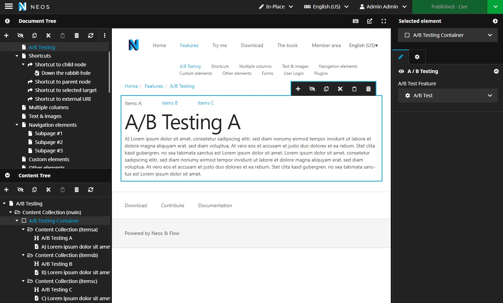

# wysiwyg* - Neos A/B Testing


This package provides a simple to use backend module and frontend container to run A/B tests in Neos.  


## Installation
Run these commands to install the package and update the database schema.
```bash
composer require wy/neos-abtesting

./flow flow:doctrine:migrate
```

## Usage
  

  

This package offers a node container for displaying two different nodes for two different decisions (A or B).

You can add the A/B testing container to your constraints: `Wysiwyg.ABTesting:ABTestingContainer`  

The container has two contentCollections:
* itemsa
* itemsb

By default these collections accept all content nodes.
This can be changed by overriding the respective node configuration in your own NodeTypes.yaml file.
An editor has to put one or more nodes in each content collection.

**IMPORTANT**  
Both versions will always be rendered in the Neos backend.
Per default version A will be displayed in the frontend if no feature has been configured and selected.

You can find an option group "A / B Testing" in each ABTestingContainer.
This group provides a dropdown menu to choose which feature will be used for the container.

#### Preview Different Versions
Sometimes it is necessary to view a different version of the feature.  
For viewing a different version add the "forceABVersion" GET-parameter into the url and assign the desired version as the value.  
  
  
Example:  
Show Version A  
```https://example.com/greatFeature.html?forceABVersion=a```  
Show Version B  
```https://example.com/greatFeature.html?forceABVersion=b```  

This parameter will not override the cookie value.

### Backend-Module Usage
You will find a new "A/B Testing" menu item in the main menu of the Neos backend.
The module "Features" will offer all necessary functions to manage A/B testing features.
In the A/B testing dashboard you will find the following options:
* "Create Feature": Add a new A/B test feature
* "Feature List": Shows a list of all A/B test features  

**Feature List**  
  

## Settings
This package uses default values for creating a cookie.  
There are several settings which can be modified for your own implementation. 

```yaml
Wysiwyg:  
  ABTesting:  
    cookie:  
      name: 'WYSIWYG_AB_TESTING'  
      lifetime: '+2 years'  
```

Per default the cookie has a lifetime of 2 years. Please consider that [strtotime()](https://www.php.net/manual/de/function.strtotime.php) is used to evaluate the lifetime setting's value if you need to adjust it.


## Regarding Privacy (i.e. GDPR)
Please note that all A/B testing decisions will be saved in a cookie that by default is named "WYSIWYG_AB_TESTING" and has a lifetime of 2 years.
This cookie will be created whenever a user opens the webpage for the first time.  
It contains a raw JSON string which includes all names of the features and their decision (a or b).  
Whenever a user enters the page and already has the cookie, it will be made sure that all active features are saved with a decision. If there are new features they will be added to the cookie and a new JSON string will be saved with all decisions.  

## Contributing
Pull requests are welcome. For major changes please open an issue first to discuss what you would like to change.  

## Planned Features
We want to enhance the A/B testing with more solid features.  

* Decider-Chaining  
Right now it's only possible to add one decision to a feature.  
We want to make it possible to add a chaining of deciders for example DimensionDecision AND Percentage.

## License
This package is released under the MIT License (MIT). Please see [License File](LICENSE) for more information.
